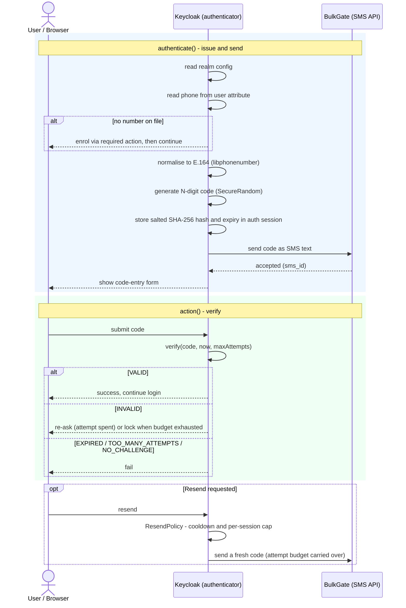

# Keycloak BulkGate SMS OTP authenticator

[](https://github.com/qcodr/keycloak-sms-provider-bulkgate/actions/workflows/ci.yml)
[](https://github.com/qcodr/keycloak-sms-provider-bulkgate/releases)
[](https://codecov.io/gh/qcodr/keycloak-sms-provider-bulkgate)
[](LICENSE)


A Keycloak authenticator that sends a one-time code by SMS through
[BulkGate](https://www.bulkgate.com/) and verifies it. Works with **Keycloak
26.6.3**.

- **Realm-configurable** — code length, TTL, attempt/resend limits, message
  text, phone-number attribute, country code and all BulkGate credentials are
  set per authenticator execution in the admin console.
- **First or second factor** — bind the same execution after a username form
  (first factor) or after the password form (second factor).
- **Keycloak owns the security boundary** — the code is generated, hashed and
  verified inside Keycloak; BulkGate is used purely as the SMS transport (its
  Advanced Transactional API). Only a salted SHA-256 hash of the code is kept in
  the authentication session — never the code itself.

> Design note: BulkGate also offers a managed OTP API (send/verify/resend). This
> plugin deliberately does **not** use it — Keycloak generates and verifies the
> code locally and BulkGate only delivers the SMS, which keeps the verification
> logic and its security properties inside Keycloak.

## How it works



### Package layout (SOLID, small focused units)

| Package | Responsibility |
|---|---|
| `otp` | Pure domain: code generation, salted hashing, the immutable `OtpChallenge`, `OtpVerifier`, `ResendPolicy`. No Keycloak dependency, fully unit-tested. |
| `phone` | `PhoneNumber` value object + `PhoneNumberNormalizer` (libphonenumber-backed, correct per-country trunk prefixes). |
| `gateway` | `SmsGateway` abstraction, `BulkGateSmsGateway` (java.net.http), `SimulationSmsGateway`, immutable `BulkGateSettings`. |
| `message` | `SmsTextFormatter` (placeholder substitution). |
| `config` | `SmsAuthenticatorConfig` (typed, validated view of the realm config) + `ConfigProperties` (admin-console fields). |
| `authenticator` | Keycloak SPI: `SmsOtpAuthenticator`, its factory, `OtpChallengeStore` (auth-session persistence), `SmsGatewayResolver`. |
| `requiredaction` | `PhoneNumberRequiredAction` — phone-number enrollment. |

## Configuration

All keys are set per authenticator execution (Admin Console → Authentication →
your flow → the *BulkGate SMS OTP* execution → ⚙ Config).

| Key | Default | Meaning |
|---|---|---|
| `codeLength` | `6` | Digits in the code (4–10). |
| `codeTtlSeconds` | `300` | How long a code is valid. |
| `maxVerifyAttempts` | `3` | Wrong guesses allowed **per login session** (a resend does not reset this). |
| `resendCooldownSeconds` | `30` | Minimum delay between resends. |
| `maxResends` | `3` | Resends allowed per login session. |
| `smsTextTemplate` | _(blank)_ | SMS body **override**. Leave blank to use the per-locale `bulkgateSmsText` message (the SMS then matches the user's language). Set a value to force one fixed text. Placeholders: `%code%`, `%ttl%`. |
| `phoneNumberAttribute` | `phoneNumber` | User attribute holding the number. The default maps to Keycloak's built-in OIDC `phone_number` claim. |
| `phoneNumberVerifiedAttribute` | `phoneNumberVerified` | Attribute set to `true` after a successful OTP; maps to the `phone_number_verified` claim. |
| `markPhoneVerified` | `true` | Whether a successful OTP stamps the phone-verified attribute. |
| `defaultCountryCode` | `+36` | Dialing code for numbers stored without an international prefix. |
| `simulationMode` | `false` | Log the code instead of sending it (**development only**). |
| `bulkgateApiUrl` | `https://portal.bulkgate.com/api/1.0/advanced/transactional` | Endpoint (http/https only). |
| `bulkgateApplicationId` | — | BulkGate Application ID. |
| `bulkgateApplicationToken` | — | BulkGate Application Token (stored as a secret). |
| `bulkgateSenderId` | `gSystem` | Sender id type: `gSystem`, `gText`, `gOwn`, `gProfile`, `gMobile`, `gPush`. |
| `bulkgateSenderIdValue` | — | Value for the sender id type (e.g. a text sender name). |
| `bulkgateUnicode` | `false` | Send as Unicode. |
| `bulkgateCountry` | — | Optional ISO country hint for BulkGate. |

### Standard OIDC phone integration

The defaults follow Keycloak's own conventions instead of a custom attribute:

- The number lives in the **`phoneNumber`** user attribute, which Keycloak's
  built-in (optional) **`phone` client scope** maps to the standard OIDC
  `phone_number` claim — request the `phone` scope and the number flows into the
  token with zero extra config.
- A successful OTP stamps **`phoneNumberVerified=true`** (and the required action
  resets it to `false` when a new number is entered), which the same scope maps
  to `phone_number_verified`. Build conditional flows on it (e.g. only force SMS
  setup when not yet verified).

Recommended (and what the demo realm does): **declare** these attributes in the
realm's declarative user profile — with validation and edit permissions — rather
than enabling the blanket unmanaged-attribute policy. See
[docker/realm/bulkgate-demo-realm.json](docker/realm/bulkgate-demo-realm.json)
for a ready-made user-profile declaration.

### Localization

The plugin ships translated message bundles
(`theme-resources/messages/messages_<locale>.properties`) for: English, Czech,
Danish, German, Spanish, French, Hungarian, Italian, Lithuanian, Latvian,
Polish, Portuguese, Romanian, Slovak, Swedish, Ukrainian. Enable the locales in
*Realm settings → Localization*; Keycloak then shows a language switcher on the
login pages and untranslated keys fall back to English. The demo realm enables
all of them (default `hu`).

This covers the login UI **and the SMS body itself**: when `smsTextTemplate` is
left blank, the text comes from the per-locale `bulkgateSmsText` message resolved
in the user's locale — so the code SMS arrives in the same language as the login
page. Set `smsTextTemplate` only if you want one fixed text regardless of locale.

## Build

Java 21+ is required (Docker only for the e2e tests / demo). Maven is **not**
needed — the Gradle wrapper is bundled. A `Makefile` wraps the common tasks:

```bash
make            # list all targets
make jar        # build the provider jar  → build/libs/*.jar
make build      # compile + lint + static analysis + tests + jar
make test       # fast unit + WireMock tests (no Docker)
make e2e        # Docker-backed end-to-end tests
make format     # auto-format (Spotless / palantir-java-format)
make check      # lint + static analysis + tests
make up / down  # start / stop the local demo stack
```

Code quality is enforced on `build`/`check` and in CI: **Spotless**
(palantir-java-format), **Error Prone** (compile-time bug patterns), and
**SpotBugs + FindSecBugs** (bug + security analysis). See
[.github/workflows/ci.yml](.github/workflows/ci.yml).

`make jar` is equivalent to `./gradlew shadowJar`. The jar bundles only
libphonenumber; all Keycloak/Jackson classes are provided by the server at
runtime.

## Installation

Requirements: Keycloak **26.6.3** and Java 21+ on the server.

1. **Get the provider jar** — download the prebuilt fat jar from the
   [Releases](https://github.com/qcodr/keycloak-sms-provider-bulkgate/releases)
   page (published per `v*` tag, with a `SHA256SUMS.txt`), or build it yourself:

   ```bash
   make jar      # → build/libs/keycloak-bulkgate-sms-authenticator-<version>.jar
   ```

2. **Deploy it.** Copy the jar into Keycloak's provider directory:

   ```bash
   cp build/libs/keycloak-bulkgate-sms-authenticator-*.jar "$KEYCLOAK_HOME/providers/"
   ```

   The FreeMarker forms and message bundles are inside the jar
   (`theme-resources/`); no separate theme installation is needed.

3. **Rebuild the server augmentation and start Keycloak.**

   ```bash
   "$KEYCLOAK_HOME/bin/kc.sh" build
   "$KEYCLOAK_HOME/bin/kc.sh" start        # or start-dev for local testing
   ```

   On a container image, mount the jar into `/opt/keycloak/providers/` and let the
   entrypoint run the build (as the [docker-compose.yml](docker-compose.yml) demo
   does).

4. **Verify it loaded.** In the admin console, *Authentication → Flows → Add
   step* should list **BulkGate SMS OTP**, and *Authentication → Required
   actions* should list **Configure BulkGate SMS phone number**.

### Configure it

After deploying, set the plugin up in a realm:

1. **Add the execution to a login flow.** *Authentication → Flows* → duplicate
   *browser* (or build a flow). Add the **BulkGate SMS OTP** step and set it
   **Required** — place it after the password form (second factor) or after a
   username form (first factor).
2. **Enter the BulkGate credentials.** Open the step's **⚙ (gear) → Config** and
   fill in at least `bulkgateApplicationId` and `bulkgateApplicationToken` from
   your BulkGate API application. Adjust code length, TTL, attempt/resend limits,
   message text, the phone-number attribute and default country code as needed —
   see the [Configuration](#configuration) table for every field. (For a dry run
   without real SMS, turn on `simulationMode` — development only.)
3. **Bind the flow.** *Authentication → Flows* → your flow → *Action → Bind flow
   → Browser flow*.
4. **Give users a phone number.** Store it in the configured attribute
   (`phoneNumber` by default). Users without one are sent through the *Configure
   BulkGate SMS phone number* required action on their next login. **Declare**
   `phoneNumber` (and `phoneNumberVerified`) in the realm's declarative user
   profile so they persist and validate — see the demo realm for an example; the
   blanket unmanaged-attribute policy works too but is less controlled.

## Tests

```bash
./gradlew test       # fast unit + WireMock integration tests (no Docker)
./gradlew e2eTest    # full browser login against real Keycloak + mocked BulkGate (Docker)
```

- **Unit / integration** — the pure OTP/phone/config logic plus the BulkGate
  gateway against an in-process WireMock.
- **E2E** — spins up Keycloak 26.6.3 with the provider deployed and a WireMock
  standing in for BulkGate (Testcontainers), configures a realm via the admin
  client, then drives the real login pages with HtmlUnit: it logs in with
  password, reads the OTP that was "sent" to WireMock, submits it, and asserts
  the authorization code comes back. A second test asserts a wrong code is
  rejected and keeps the user on the form.

## Local demo (Docker Compose)

```bash
make up            # = ./gradlew shadowJar && docker compose up
```

This starts Keycloak (`http://localhost:8080`) with the provider deployed and a
WireMock BulkGate mock, and imports the `bulkgate-demo` realm: a `bulkgate-browser`
flow (password → SMS OTP), a public `demo-client`, and user **alice / password**
with `phoneNumber = +36201234567` (declared in the realm's user profile).

Host ports are overridable if 8080/8081 are taken:

```bash
KC_HOST_PORT=8080 WIREMOCK_HOST_PORT=8091 make up
```

Log in to the `bulkgate-demo` realm as `alice`, then read the **latest** code
that was "sent" from the WireMock journal (newest-first, transactional only):

```bash
curl -s localhost:8081/__admin/requests \
  | jq -r 'first(.requests[] | select(.request.url|test("transactional")) | .request.body | fromjson | .text)'
```

Each time the OTP form is (re)rendered a new code is issued — only the newest is
valid, so always read the latest entry. Use a fresh/incognito window to avoid
stale login cookies.

## Security notes & known limitations

- **Code security.** Only a salted SHA-256 hash is stored, comparison is
  constant-time (`MessageDigest.isEqual`), expiry and the attempt budget are
  checked before any comparison, and the attempt budget is **per login session**
  (a resend cannot reset it). `SecureRandom` backs both the code and the salt.
- **Simulation mode** logs the code in cleartext and must **never** be enabled in
  production. It is intended only for local development.
- **Phone enrollment is not ownership-verified at entry.** The required action
  stores the typed number with `phoneNumberVerified=false` (a required action has
  no access to the BulkGate config to send a code); the first successful OTP then
  flips it to `true`. If a user has no number on file the authenticator enrolls
  them and completes — so **do not deploy this as a sole first factor** unless you
  accept that unenrolled users pass it during enrollment. Prefer second-factor
  use, an admin-provisioned number, or gate access on `phoneNumberVerified`.
- **`phoneNumberAttribute` customization.** Keycloak does not pass the execution
  config to `configuredFor()` or to required actions, so the “is configured”
  check and the enrollment action use the **default** attribute name
  (`phoneNumber`) and the **default** country code (`+36`). Keep these at their
  defaults unless you populate the attribute yourself; otherwise enrolled users
  may be re-prompted.
- **SMS pumping.** Resend throttling is per session. To bound cost/abuse across
  sessions, enable Keycloak realm **brute-force detection** and place Keycloak
  behind a rate-limiting reverse proxy.

## License

Apache License 2.0 — see [LICENSE](LICENSE). Portions are derived from
[netzbegruenung/keycloak-mfa-plugins](https://github.com/netzbegruenung/keycloak-mfa-plugins)
(Apache-2.0); see [NOTICE](NOTICE).
